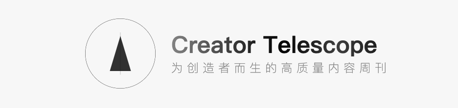

🔭 Creator-telescope Weekly Publication.

---

`Creator Telescope` 由 [Archer](https://xiaoa.name) 创办，他坚信：「创造者经济时代」已经来临，一人公司、超级个体正在迅速崛起，尤其在今天的 AI 加持下。

众所周知，如今，信息的收集和加工已经变得非常简单且舒适，但是信息茧房、信息过载问题仍然存在，越来越多的用户钟爱优质内容，很多平台也逐步回归订阅逻辑而不是推荐逻辑，跟博客的定位不一样，`Newsletter` 更侧重于站在读者的角度思考问题，也有很多现成的平台可以提供类似的能力，比如国外的 `Substack`、国内的`小报童`等，考虑到自主可控、用户体验优先的原则，`Creator Telescope` 坚持使用「自建平台」的方式。

同时，`Creator Telescope` 坚持内容原创，以独立站及周报（Weekly Publication）的形式触达读者，稍后也将逐步完善功能及生态：

* 邮件订阅 / RSS 订阅
* 搜索
* 暗黑模式
* 浏览器主页插件

`Creator Telescope` 在内容上聚焦满足「独立开发」、「独立创客」、「创造者」等此类画像的用户可能关注的内容，包含技术指南、产品洞察、成功故事、一线资讯、深度思考等等。

---

`Creator Telescope` was founded by [Archer](https://xiaoa.name), who firmly believes that “the era of the creator economy” has arrived, and one-person companies and super-individuals are rapidly rising, especially with today's AI support.

As we all know, the collection and processing of information has become very simple and comfortable, but the problem of information cocoon and information overload still exists, more and more users love high-quality content, and many platforms have gradually returned to the subscription logic instead of the recommendation logic, which is different from the positioning of blogs, and the `Newsletter` focuses more on thinking about the problem from the readers' point of view. There are also many ready-made platforms that can provide similar capabilities, such as `Substack` in foreign countries and `Small Newspaper Boy` in China, etc. Considering the principle of autonomy and control and prioritizing the user experience, `Creator Telescope` insists on using the method of `self-built platform`.

Meanwhile, `Creator Telescope` insists on original content and reaches its readers with independent websites and weekly publications, and will gradually improve its functions and ecosystem later on:

* Email subscription / RSS subscription
* Search
* Dark Mode
* Browser homepage plugin

`Creator Telescope` focuses on content that meets the needs of users with such profiles as `independent developers`, `independent creators`, `creators`, etc., including technical guides, product insights, success stories, front-line information, in-depth thoughts, etc.
